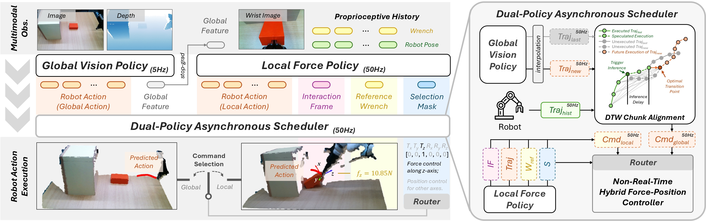
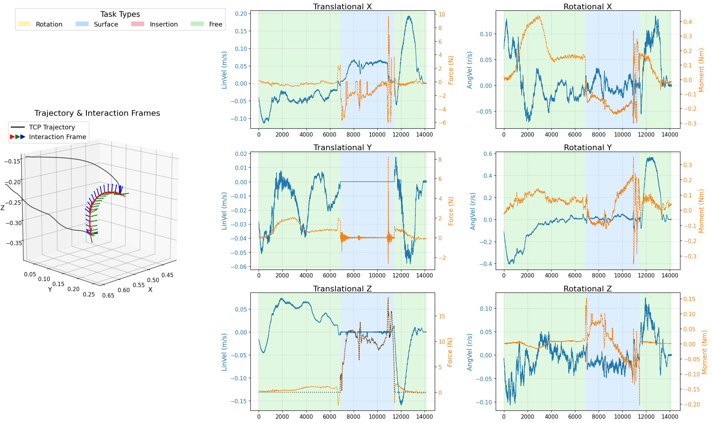

<div align="center">
  

  <h1>Force Policy: Learning Hybrid Force-Position Control Policy under Interaction Frame for Contact-Rich Manipulation</h1>

  <p><strong>Robotics: Science and Systems (RSS), 2026</strong></p>

  <p>
    <a href="https://tonyfang.net/">Hongjie Fang</a><sup>*13</sup>,
    <a href="https://www.linkedin.com/in/shiruntang/">Shirun Tang</a><sup>*1</sup>,
    <a href="https://github.com/zming-Mei">Mingyu Mei</a><sup>*14</sup>,
    <a href="https://github.com/1JI0O">Haoxiang Qin</a><sup>3</sup>,
    <a href="https://alan-heoooh.github.io/">Zihao He</a><sup>3</sup>,
    <a href="mailto:jjchen20@sjtu.edu.cn">Jingjing Chen</a><sup>3</sup>,
    <a href="mailto:fyyy0407@sjtu.edu.cn">Ying Feng</a><sup>35</sup>,
    <a href="https://scholar.google.com/citations?user=bK1fWXcAAAAJ">Chenxi Wang</a><sup>1</sup>,
    <a href="mailto:wanxi.liu@flexiv.com">Wanxi Liu</a><sup>12</sup>,
    <a href="https://person.zju.edu.cn/en/zaixinghe">Zaixing He</a><sup>4</sup>,
    <a href="https://www.mvig.org/">Cewu Lu</a><sup>1235</sup>,
    <a href="mailto:shiquan.wang@flexiv.com">Shiquan Wang</a><sup>12†</sup>
  </p>

  <p><sup>1</sup>Noematrix  <sup>2</sup>Flexiv  <sup>3</sup>Shanghai Jiao Tong University  <sup>4</sup>Zhejiang University  <sup>5</sup>Shanghai Innovation Institute</p>
  <p><sup>*</sup>Equal contribution.  <sup>†</sup>Corresponding author.</p>

  <p>
    <a href="https://arxiv.org/abs/2602.22088">
      
    </a>
    <a href="https://force-policy.github.io">
      
    </a>
  </p>
</div>

Force Policy is a global-local vision-force policy for contact-rich manipulation. A **global vision
policy** (RISE-2) guides free-space motion, and upon contact a **high-frequency local force policy**
estimates the *interaction frame* and executes hybrid force-position control. A **dual-policy
asynchronous scheduler** coordinates the two policies during deployment.



## 📁 1. Repository Structure

```
ForcePolicy/
├── adaptor/               # Interaction Frame (IF) recovery & labeling pipeline
│   ├── interaction_frame/ # frame identifiers (twist_wrench / wrench_only / ...), labelers
│   └── visualization/     # 2D/3D labeling visualization
├── policy/                # Policy networks
│   ├── force_policy/       # local force policy (ResNet+FiLM, GRU, gated fusion, MIP/MLP heads)
│   ├── vision_policy/      # RISE / RISE-2 (global policy)
│   └── policy_modules/     # RISE sparse(Minkowski)/dense(DINOv2) modules, diffusion, MIP
├── data_infra/            # datasets, processors, normalization, augmentation, point cloud ops
├── trainer/               # DDP trainer
├── runner/                # deployment: agents, schedulers (slow-fast / adaptive / vanilla), DTW
├── vision_feat_generator/ # offline RISE-2 feature extraction (global feature φ(I))
├── configs/               # task/agent/dataset/processor/scheduler/policy/adaptor configs
├── scripts/               # data preprocessing, calibration, labeling, visualization tools
├── utils/                 # transforms (pose/rotation/twist), visualization helpers
├── run_adaptor.py         # IF labeling entry
├── run_generator.py       # vision feature generation entry
├── run_trainer.py         # training entry
└── run_eval.py            # real-robot evaluation entry
```

---

## ⚙️ 2. Environment Setup

Tested with Python 3.10, CUDA 12.x, PyTorch 2.4.1.

```bash
conda create -n forcepolicy python=3.10 -y
conda activate forcepolicy

# Core dependencies
pip install -r requirements.txt
```

### RISE-2 vision backbone (PyTorch, MinkowskiEngine, PyTorch3D, DINO weights)

The global policy reuses the RISE-2 backbone, so its environment must be set up the same way. **Follow
the official [RISE-2 installation guide](https://github.com/rise-policy/RISE-2/blob/main/assets/docs/INSTALL.md)**
for PyTorch, MinkowskiEngine, PyTorch3D, and the pretrained DINO weights. Key points:

- Use **CUDA 12.1** to avoid compatibility issues (set `CUDA_HOME` before building).
- **MinkowskiEngine** — do **not** install the official NVIDIA package. RISE-2 ships a patched fork that
  builds against CUDA 12.x; install it from
  [`chenxi-wang/MinkowskiEngine` (`cuda-12-1` branch)](https://github.com/chenxi-wang/MinkowskiEngine)
  exactly as described in the RISE-2 guide. This sparse 3D conv backbone is used by RISE-2.
- **PyTorch3D** — install from source per the RISE-2 guide; used here by `utils/transforms/rotation.py`
  for rotation conversions.
- **DINO weights** — download the pretrained DINOv2/DINOv3 weights into a `weights/` folder following the
  RISE-2 guide; the RISE-2 dense encoder loads them from there.

### Deployment-only dependencies

Required only for real-robot evaluation (`run_eval.py`), not for training:

- **[`easyrobot`](https://github.com/force-policy/easyrobot)** — hardware abstraction for the Flexiv arm/gripper and Intel RealSense cameras.
- **[`flexivrdk`](https://github.com/flexivrobotics/flexiv_rdk)** — Flexiv Rizon SDK (hybrid force-position controller interface).

> The hardware platform in the paper is a Flexiv Rizon 4 arm with a GN-02 gripper, a flange-mounted
> 6-DoF force/torque sensor, and two Intel RealSense D415 cameras (one global, one wrist-mounted).

---

## 📊 3. Data

### 3.1 Collection

Demonstrations are collected with an **arm-to-arm teleoperation system with force feedback**
([Flexiv TDK](https://github.com/flexivrobotics/flexiv_tdk)), 50 demonstrations per task. In this
setup a leader and a follower arm are synchronized with force/torque feedback, so the operator feels
the contact forces measured at the follower during teleoperation. During recording:

- RGB-D images are saved at **15 Hz**;
- robot state (end-effector pose, end-effector velocity, force/torque) is recorded at **1000 Hz**.

> **Provided data & checkpoints (Push and Flip).** For the full **Push and Flip** task we provide the
> sample demonstrations we used, together with the trained RISE-2 and Force Policy checkpoints:
> **[Google Drive](https://drive.google.com/drive/folders/1ioEFZoJbk5hjqBs8TCiL66DwCQGdCA1E)**.

### 3.2 Expected directory layout (per task)

```
data/<task>/<split>/
  scene_0001/
    cam_<serial>/
      color/<timestamp_ms>.png
      depth/<timestamp_ms>.png
      intrinsic.npy            # 3x3
      extrinsic.json           # {"pose_in_link": [x,y,z,qw,qx,qy,qz]}
    lowdim/
      lowdim.h5                # raw recording
      lowdim_filled.h5         # 1000 Hz interpolated (scripts/fill_data.py)
      lowdim_labeled.h5        # IF / wrench / mask labels (run_adaptor.py)
      vision_feat_<cam>.h5     # precomputed global feature (run_generator.py)
  scene_0002/
  ...
```

Lowdim HDF5 fields carry a robot/arm id suffix (e.g. `tcp_pose_062703`, `force_torque_062703`).

### 3.3 Preprocessing pipeline

1. **Calibration.** You need to calibrate the global camera(s), then convert the result into
   the required format with the scripts below:

   ```bash
   python scripts/save_intrinsic.py --serial <camera_serial> --output intrinsic.npy
   python scripts/generate_calib.py --camera global:<serial>:intrinsic.npy:extrinsic.json --main_serial <serial> --output_path calib/
   python scripts/sync_calib_to_scenes.py --calib_dir calib/ --data_root data/<task>/<split> --camera_serial <serial>
   ```

2. **Interpolate low-dim signals to 1000 Hz:**

   ```bash
   python scripts/fill_data.py \
     --data_path data/<task>/<split> \
     --fields_info "tcp_pose:lowdim.h5:tcp_pose_<id>:float64:pose_linear ..." \
     --save_name lowdim_filled.h5
   ```

   (`--save_name` is given without the extension; `fill_data.py` writes `lowdim_filled.h5`, which is
   the interpolated low-dim file consumed by the adaptor and the training datasets.)

3. **Interaction Frame (IF) labeling.** The labeler recovers the IF orientation, the four task modes
   (Free / Surface / Insertion / Rotation), the selection mask `S`, and the reference wrench.

   > **Important — use the per-task adaptor config.** The adaptive (`twist_wrench`) method needs
   > **different thresholds for each task**, so every task has its **own** config file. Pass it via
   > `--adaptor` (resolved by name to `configs/adaptor/<name>.py`). Do **not** reuse one task's config
   > for another.
   >
   > | Paper task | `--adaptor` | Config file |
   > | --- | --- | --- |
   > | Push and Flip | `twist_wrench_flip` | `configs/adaptor/twist_wrench_flip.py` |
   > | Plug in EV Charger | `twist_wrench_charger` | `configs/adaptor/twist_wrench_charger.py` |
   > | Scrape off Sticker | `twist_wrench_shovel` | `configs/adaptor/twist_wrench_shovel.py` |

   Run it once per task (example uses Push and Flip; swap `--adaptor` and `--task_path` for the others):

   ```bash
   python run_adaptor.py \
     --adaptor twist_wrench_flip \
     --task_path data/<task>/<split> \
     --lowdim_name lowdim_filled.h5 \
     --save_lowdim_name lowdim_labeled.h5 \
     --tcp_pose_key tcp_pose_<id> --tcp_vel_key tcp_vel_<id> --wrench_key force_torque_<id>
     --vis_name adaptor_result.png
   ```

   **Choosing the power source (`specify`).** The dominant contact power source selects the IF
   reconstruction formula: `dissipative` (friction dominates) → `specify='twist'` (orthogonalize
   wrench against twist); `structural` (stiffness dominates) → `specify='wrench'` (orthogonalize
   twist against wrench). It can be set in three ways:

   **Option 1 — Using Gemini.** Classify the power source per patch from the patch's initial frame,
   yielding a time-varying `specify` along the trajectory. This is a two-step process.

   1. Produce a per-patch `specify` sequence for every scene. Use the **same `--patch_size`** as the
      task's adaptor config (10 for flip/charger, 50 for shovel), and a task **reference image**
      showing the overall phase scope (omit `--reference_image` to fall back to each scene's first
      frame):

      ```bash
      export GEMINI_API_KEY=<your_key>
      python scripts/classify_power_source.py \
        --task_path data/<task>/<split> \
        --task_description "flip the box: a constrained rotation of the orange box against the vertical wall boundary to transition it from a horizontal to a vertical pose, maintaining contact with the wall to overcome interface friction" \
        --patch_size 10 \
        --reference_image path/to/task_reference.png \
        --lowdim_name lowdim_filled.h5 \
        --output power_source_specify.json
      ```

      This writes `power_source_specify.json` into each scene's `lowdim/` directory, containing a
      per-patch `specify` list aligned 1:1 with the adaptor's patches.

   2. Run the adaptor with `--specify_seq_name` so it consumes the per-patch sequence (the
      `--patch_size` in step 1 must match this adaptor config):

      ```bash
      python run_adaptor.py \
        --adaptor twist_wrench_flip \
        --task_path data/<task>/<split> \
        --lowdim_name lowdim_filled.h5 \
        --save_lowdim_name lowdim_labeled.h5 \
        --tcp_pose_key tcp_pose_<id> --tcp_vel_key tcp_vel_<id> --wrench_key force_torque_<id> \
        --specify_seq_name power_source_specify.json
      ```

   If using Gemini (or another LLM) is inconvenient, the power source can also be set manually from
   expert knowledge, or detected automatically with a kinematic threshold:

   **Option 2 — Specify.** If you already know a task is purely dissipative or structural, hard-set
   `specify='twist'` or `specify='wrench'` in `configs/adaptor/twist_wrench_<task>.py`, then run the
   `run_adaptor.py` command above (without `--specify_seq_name`).

   **Option 3 — Auto detect.** Set `specify='auto'` in the task's adaptor config to switch by a
   kinematic threshold, then run the `run_adaptor.py` command above (without `--specify_seq_name`).

   Visualize the labels for QC (see §3.4 for how to read the plot and tune the config):

   ```bash
   python scripts/visualize/vis_label.py --tcp_file <lowdim_filled.h5> --labeled_file <lowdim_labeled.h5>
   python scripts/visualize/vis_label_3d.py --cam_dir <scene>/cam_<serial> --tcp_file ... --labeled_file ...
   ```

### 3.4 Configuring & tuning the adaptor for your own task

Label quality directly determines Force Policy performance, so **iterate on the adaptor config until the
labels look right before training.** The workflow is: run the adaptor with visualization → inspect the
plot → adjust thresholds → repeat. We walk through it with the **Push and Flip** task and
`configs/adaptor/twist_wrench_flip.py`.

**Step 1 — Run the adaptor with visualization.** Add `--vis_name` to `run_adaptor.py` to render a
per-scene labeling plot into each scene's `lowdim/` directory:

```bash
python run_adaptor.py \
  --adaptor twist_wrench_flip \
  --task_path data/flip/train \
  --lowdim_name lowdim_filled.h5 \
  --save_lowdim_name lowdim_labeled.h5 \
  --tcp_pose_key tcp_pose_<id> --tcp_vel_key tcp_vel_<id> --wrench_key force_torque_<id> \
  --vis_name label_vis
```

You can also regenerate the plot for our bundled single-scene example without any data collection:

```bash
python scripts/visualize/vis_label.py \
  --tcp_file assets/example_flip_lowdim_filled.h5 \
  --labeled_file assets/example_flip_lowdim_labeled.h5
```

**Step 2 — Read the visualization.** The plot below is the expected result for a good flip label:



- **Left (3D):** the TCP trajectory (black) with the recovered **Interaction Frame** drawn along contact
  phases (red = x / motion axis, green = y, blue = z / contact-normal axis). Check that the frame is
  stable and physically sensible — e.g. z pointing into the contact/wall, x along the sliding/rotating
  direction — rather than flipping around randomly.
- **Right (6 panels):** twist (blue, m/s or rad/s) and wrench (orange, N or Nm) **expressed in the
  Interaction Frame**, per axis. The background color is the classified task mode
  (**Free** / **Surface** / **Insertion** / **Rotation**). Check that the shading matches what actually
  happens (free approach → contact/press → constrained rotation), and that the force concentrates on the
  expected axis (here, the normal axis) once contact starts.

**Step 3 — Tune the parameters.** `configs/adaptor/twist_wrench_flip.py` builds a `DataAdaptorConfig`
with three parts:

- **`patch_size`** — number of consecutive 1000 Hz samples that share one IF / one task-mode decision.
  Smaller = finer in time but noisier; larger = smoother but blurs fast transitions (flip/charger use
  `10`, shovel uses `50`). If the mode shading flickers with many tiny segments, increase it.
- **`calc_twist_from_pose`** — if `True`, twist is differentiated from pose; if `False`, the recorded
  `tcp_vel` is used. Use `True` only when recorded velocity is missing/noisy.

`frame_identifier_config` (`TwistWrenchFrameIdentifier`) recovers the IF orientation per patch:

- **`specify`** — power source, `'auto' | 'twist' | 'wrench'` (see §3.3). Controls which signal is
  orthogonalized against which when building the frame.
- **`weight_angular`** — how much angular velocity (vs. linear velocity) contributes to the motion (x)
  axis. Raise it for rotation-dominated tasks like flipping so the frame follows the rotation.
- **`weight_torque`** — how much moment (vs. force) contributes to the contact-normal (z) axis. Raise it
  when the informative contact signal is torque rather than force.
- **`thres_lin_vel` / `thres_ang_vel`** — in `'auto'` mode, the speed thresholds that decide
  twist-dominant vs. wrench-dominant behavior for a patch.
- **`thres_parallel`** — when the candidate motion and force axes are nearly parallel (dot product above
  this), the frame falls back to a safe default to avoid a degenerate/ambiguous orientation.

`frame_labeler_config` (`AdvancedFrameLabelerConfig`) classifies each patch into Free/Surface/
Insertion/Rotation and produces the selection mask `S` and reference wrench:

- **`thres_force` / `thres_torque`** — contact detection thresholds. Force/torque below these means "no
  contact" → the patch is labeled **Free**. Lower them if contact onset is detected too late; raise them
  if noise creates spurious contact.
- **`thres_lin_vel` / `thres_ang_vel`** — velocity thresholds separating motion vs. quasi-static and
  rotation-dominated modes.
- **`thres_is_parallel`** — alignment threshold used when deciding axis relationships for the mode/mask.

Temporal-smoothing knobs on `DataAdaptorConfig` (`enable_smoothing`, `min_run_length`, `conf_threshold`,
`sim_threshold`, `sim_window_size`) clean up short, low-confidence mode runs; if real short phases get
absorbed, raise `sim_threshold` or lower `min_run_length`.

**Step 4 — Iterate.** Re-run Step 1 after each change and re-inspect the plot. Typical fixes: contact
detected too late/early → adjust `thres_force`; too many spurious mode flips → increase `patch_size` or
`min_run_length`; the frame flips near parallel configurations → tune `thres_parallel` /
`thres_is_parallel`; rotation/torque under-represented in the frame → raise `weight_angular` /
`weight_torque`. Only once the labels look clean and consistent across scenes should you proceed to
training.

---

## 🚀 4. Training

Force Policy is trained in two stages. **Stage 1** trains and freezes the global RISE-2 policy and
extracts its 512-D action feature; **Stage 2** trains the local force policy conditioned on that
feature. Replace `<task>` triplets using the table below.

| Paper task | `<dataset_vis>` | `<dataset_wrist>` | `<rise2_processor>` | `<force_processor>` |
| --- | --- | --- | --- | --- |
| Push and Flip | `flip_v3_vision_only` | `flip_v3_wrist` | `flip.RISE2` | `flip.force_policy.wrist` |
| Plug in EV Charger | `charger_v2_vision_only` | `charger_v2_wrist` | `charger.RISE2_top` | `charger.force_policy.wrist` |
| Scrape off Sticker | `shovel_vision_only` | `shovel_wrist` | `shovel.RISE2` | `shovel.force_policy.wrist` |

### Stage 1 — Train global RISE-2

```bash
CUDA_VISIBLE_DEVICES=0,1,2,3 torchrun --nproc_per_node 4 run_trainer.py \
  --trainer RISE2 \
  --dataset <dataset_vis> \
  --processor <rise2_processor> \
  --policy vision_policy.RISE2_robot_only \
  --wrapper vision_policy.RISE2_robot_only \
  --ckpt_dir logs/log_<task>_rise2/
```

### Stage 1.5 — Generate global vision features φ(I)

```bash
CUDA_VISIBLE_DEVICES=0 python run_generator.py \
  --dataset <dataset_vis> \
  --processor <rise2_processor> \
  --policy vision_policy.RISE2_robot_only \
  --wrapper vision_policy.RISE2_robot_only \
  --ckpt_path logs/log_<task>_rise2/policy_last.ckpt
```

This writes `vision_feat_<cam>.h5` into each scene's `lowdim/` directory.

### Stage 2 — Train local Force Policy

```bash
CUDA_VISIBLE_DEVICES=0,1 torchrun --nproc_per_node 2 run_trainer.py \
  --trainer force_policy \
  --dataset <dataset_wrist> \
  --processor <force_processor> \
  --policy force_policy.vision_feat_wrist_vision_cond_comb_lowdim_cond_gated_with_global_sep_action_mip_other_1_step \
  --wrapper force_policy.force_policy \
  --ckpt_dir logs/log_<task>_force_policy/
```

The main configuration `..._sep_action_mip_other_1_step` uses separate decoder heads: a MIP head for
the 50 Hz action chunk and MLP heads for the interaction frame, reference wrench, and selection mask.
Loss weights: `action=1.0, frame=1.0, force=1.0, mask=0.1`.

---

## 🤖 5. Deployment (Real Robot)

Deployment uses the dual-policy asynchronous **slow-fast scheduler**: RISE-2 runs as the slow global
policy and Force Policy runs as the fast local policy at 50 Hz, routed by the predicted selection
mask `S`, with DTW-based chunk alignment and acceleration-continuous trajectory planning dispatched to
the Flexiv hybrid force-position controller.

> **Hardware configuration required.** Camera serials, robot serials, and extrinsics are hard-coded in
> `configs/agent/<profile>/agent.py` and `configs/agent_class/<task>.py`. Update these to match your
> own setup. Deployment requires [`easyrobot`](https://github.com/force-policy/easyrobot) and
> [`flexivrdk`](https://github.com/flexivrobotics/flexiv_rdk).

### 5.1 Configuring your own `agent` and `agent_class`

The provided profiles are tied to our hardware (serials, extrinsics, joint poses). For your own robot
you must create two configs. Both are resolved by name, so copy an existing one as a template and rename.

**`configs/agent/<your_profile>/`** — describes the *physical platform* and what each policy observes.
It is a small package with three files:

- `agent.py` — instantiate your hardware and build `agent_config = RealAgentConfig(...)`:
  - construct your `FlexivArm(...)`, `RealSenseRGBDCamera(...)`, and grippers with **your own robot/camera
    serials** and the matching shared-memory managers;
  - fill `platform_config` (camera/robot names), `robots`, `cameras`, `intrinsics`, `extrinsics`
    (4×4 camera-to-base matrix, hand-eye calibrated), `robot_poses`, and `force_control_robot_names`.
- `obs_key.py` — define `obs_key_configs`, one `AgentObsKeysConfig` per observation key:
  - `vision_RISE2` (slow/global policy): which color/depth/intrinsic/extrinsic cameras it reads;
  - `force_policy` (fast/local policy): the wrist `color_keys` plus the `lowdim_provider_keys` it needs
    (e.g. `tcp_pose`, `force_torque`, `aux_tcp_pose`).
  - These keys are passed at runtime via `--agent_obs_keys` and `--fast_agent_obs_keys`.
- `__init__.py` — leave empty.

**`configs/agent_class/<your_task>.py`** — defines a task-specific `Agent(RealAgent)` subclass,
mainly the `ready()` routine that brings the robot to a safe start state. Adapt:

- the **ready joint pose** (`tar_pose_q_deg`) to your workspace;
- the F/T sensor zeroing (`zero_ft_sensor`), control mode (e.g. `NRT_SUPER_PRIMITIVE`),
  `SetCartesianImpedance`, `SetForceControlAxis`, and `SetMaxContactWrench` to your task's contact regime.

Then run `run_eval.py` with `--agent <your_profile> --agent_class <your_task>`.

| Paper task | `--agent` | `--agent_class` | `--scheduler` |
| --- | --- | --- | --- |
| Push and Flip | `dual_right_two_camera` | `flip` | `flip.slow_fast` |
| Plug in EV Charger | `single_charger_top` | `charger` | `charger.slow_fast` |
| Scrape off Sticker | `dual_right_robot_only_two_camera` | `shovel` | `shovel.slow_fast` |

Example (Plug in EV Charger):

```bash
python run_eval.py \
  --processor charger.RISE2_top \
  --policy vision_policy.RISE2_robot_only \
  --wrapper vision_policy.RISE2_robot_only \
  --agent single_charger_top --agent_obs_keys vision_RISE2 --agent_class charger \
  --scheduler charger.slow_fast \
  --ckpt_path logs/log_charger_v2_rise2/policy_last.ckpt \
  --fast_processor charger.force_policy.wrist \
  --fast_policy force_policy.vision_feat_wrist_vision_cond_comb_lowdim_cond_gated_with_global_sep_action_mip_other_1_step \
  --fast_wrapper force_policy.force_policy \
  --fast_agent_obs_keys force_policy \
  --fast_ckpt_path logs/log_charger_v2_force_policy/policy_last.ckpt \
  --visualize --vis_robot right
```

---

## 🙏 Acknowledgement

- Our vision policy is built on [RISE-2](https://github.com/rise-policy/RISE-2), with the original
  CC BY-NC-SA 4.0 license. The sparse 3D encoder uses a patched
  [MinkowskiEngine](https://github.com/chenxi-wang/MinkowskiEngine), and the dense encoder uses
  DINOv2/DINOv3 features.
- Our diffusion module is adapted from [Diffusion Policy](https://github.com/real-stanford/diffusion_policy)
  (MIT License).
- Our transformer module is adapted from [ACT](https://github.com/tonyzhaozh/act), which builds on
  [DETR](https://github.com/facebookresearch/detr) (Apache-2.0 License).
- Our remote-evaluation serialization is adapted from
  [msgpack-numpy](https://github.com/lebedov/msgpack-numpy).
- Data collection uses the [Flexiv TDK](https://github.com/flexivrobotics/flexiv_tdk) force-feedback
  teleoperation system; real-robot deployment uses [`easyrobot`](https://github.com/force-policy/easyrobot)
  and the [Flexiv RDK](https://github.com/flexivrobotics/flexiv_rdk).

---


## 📚 Citation

If you find this work useful, please consider citing:

```bibtex
@inproceedings{fang2026forcepolicy,
  title     = {Force Policy: Learning Hybrid Force-Position Control Policy under Interaction Frame for Contact-Rich Manipulation},
  author    = {Fang, Hongjie and Tang, Shirun and Mei, Mingyu and Qin, Haoxiang and He, Zihao and Chen, Jingjing and Feng, Ying and Wang, Chenxi and Liu, Wanxi and He, Zaixing and Lu, Cewu and Wang, Shiquan},
  booktitle = {Proceedings of Robotics: Science and Systems (RSS)},
  year      = {2026}
}
```

----

## 📄 License & Copyright

All data, labels, code and models belong to the Noematrix Ltd. and MVIG@SJTU, and are licensed under a
[Creative Commons Attribution 4.0 Non Commercial License (CC BY-NC-SA)](https://creativecommons.org/licenses/by-nc-sa/4.0/).
They are freely available for **non-commercial use only**, and may be redistributed under these
conditions. **Commercial use is prohibited.**
